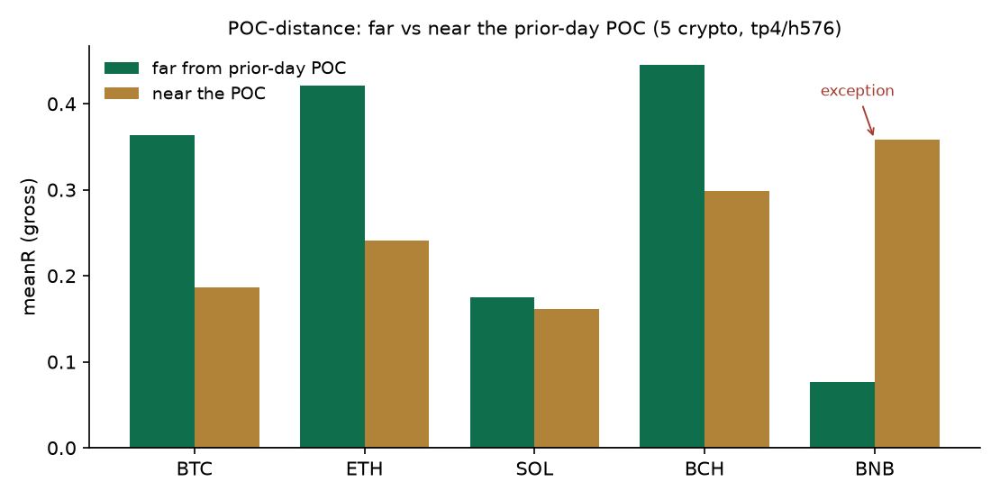

# Statistically-Validated Econophysics Edges in Crypto Derivatives

### A review of the FQ signal engine and its anti-overfitting methodology

**Status:** preprint / working draft. Open methodological review; figures and results are
reproducible from the source repository. To be hardened (full data appendix, DOIs) before
journal submission.

**Author:** RasDG (Mexico City), with FQ engineering assistance.
**Cutoff:** 2026-07-03.

---

## Abstract

We present **FQ**, a directional signal engine for cryptocurrency perpetual futures built on
the **econophysics** research program and validated with the modern anti-overfitting standard
of quantitative finance — the **Deflated Sharpe Ratio (DSR)**, **Combinatorial Purged
Cross-Validation (CPCV)** and the **Probability of Backtest Overfitting (PBO)** (López de
Prado). Unlike most retail trading systems — which report no multiple-testing correction — FQ
subjects **every** candidate edge to an explicit statistical gate and measures performance
*forward* (out-of-sample, live) before raising conviction. This review documents (i) the
validation methodology as the system's backbone; (ii) the edges that **survive** the gate —
signed order-flow (CVD), order-flow persistence (long memory), regime detection via
time-irreversibility (KL divergence), distance to the volume-profile Point of Control, and the
**funding-rate percentile** as a directional bias; (iii) the honest separation between a heuristic
**conviction layer** and the **causally-validated edge**; (iv) a *cross-asset* extension via a data/venue decoupling toward traditional markets;
and (v) an explicit graveyard of refuted ideas. The operating principle is singular:
**measure or perish.**

---

## 1. Introduction

Econophysics — the application of statistical-physics methods to markets (Mantegna & Stanley,
2000) — produced a robust core: heavy tails, power laws, square-root market impact, long
memory of order flow. The challenge is not a shortage of phenomena but **separating the real,
samplable, operationalizable edge** from the **overfitting artifact** and from *physics envy*
(importing the physical mechanism as decoration). FQ takes a strict stance: an idea enters the
engine only if (a) it passes a gate that **deflates** by how many things were tried, (b) it
**adds** within the already-confirmed edges (orthogonality), and (c) it is measured *forward*
before any capital or conviction decision. This review maps what survived.

## 2. Methodology: the validation gate

The system's core is not new data — it is **validation**. The reason is statistical: under
multiple testing, trying ~20 configurations guarantees a spurious "5% significant" result. The
**Deflated Sharpe Ratio** (Bailey & López de Prado, 2014) corrects the Sharpe ratio for the
number of trials and for non-normality (skew/kurtosis), and requires clearing the real bar
**DSR > 0.95**. It is complemented by **CPCV** (combinatorial purged cross-validation, with an
embargo, for leak-free out-of-sample estimation) and **PBO** (probability of backtest
overfitting; Bailey et al., 2017). FQ implements all three in `tools/validation_gate.py`
(stdlib + numpy). It is the highest-evidence lever of the project: it does not generate alpha,
it **certifies** it.

## 3. The validated edges

### 3.1 Signed order-flow (CVD)
Cumulative Volume Delta (aggressive-buy minus aggressive-sell volume) gives the **sign** of
flow. Its physical basis is the **square-root market-impact law** (price moves as σ·√(Q/V)),
confirmed in crypto (Donier & Bonart, 2015) and recently reconfirmed (Sato & Kanazawa, *PRL*
2025). In the harvested cube, the CVD-confirmed subset (imbalance ≥ 0.50) yields **+0.27R (SOL)
/ +0.34R (BTC)** over five years of tick data, **DSR ✓** (≈1.00 BTC / ≈0.98 SOL). The edge is
causal and free (Binance aggTrades). *Trap avoided:* a +1.47R result at n=17 was discarded by
the gate as a small-sample mirage.

### 3.2 Order-flow persistence (long memory / order-splitting)
Large orders execute in pieces, generating **positive autocorrelation of flow sign** (Lillo,
Mike & Farmer, 2005; Bouchaud, Farmer & Lillo, 2009). FQ measures the lag-1 autocorrelation
(F2). In BTC, the premium tier (CVD✓ & F2✓) reaches **DSR 0.995**. **Honest finding:** F2 is an
**idiosyncratic per-symbol** confirmer (it pays in 4 of 6 measured; negative in ETH), **not** a
universal scaling law — the "premium scales with institutional-ness" hypothesis was **refuted**
(corr = −0.19).

### 3.3 Regime via time-irreversibility (KL)
The thermodynamic arrow of time: the KL divergence between the degree distributions of the
**horizontal visibility graph** computed forward vs. backward measures distance from
equilibrium — i.e. entropy production (Kawai, Parrondo & Van den Broeck, 2007; Lacasa et al.,
2012). **No free parameters.** The edge lives in **low** irreversibility (reversible /
mean-reverting): **BTC +0.348R DSR 0.999; SOL +0.225R DSR 0.950**, monotone by quartile and
**cross-symbol**.

### 3.4 Distance to the volume-profile Point of Control
The newest piece. The prior-day volume profile defines the **POC** and the *Value Area*. FQ
measures the normalized distance of entry to the POC. The hypothesis — "do not trade in
yesterday's chop; far from the POC = trend" — **passes the cross-symbol gate**: a 5-crypto pool
(n=5162) shows uplift +0.121, **orthogonal to KL** (within-KL +0.272), **CPCV OOS +0.111 (93%
of paths positive), PBO 0.17**. It holds in **4 of 5** symbols; **BNB is the measured exception**
(far<near) and is excluded. See Appendix B for the reproducible result.

### 3.5 Funding-rate percentile (directional)
The newest piece and the **strongest gate result in the program**. Perpetual funding is the carry
that anchors the perp to spot; high funding = crowded longs (BIS WP1087 links high carry to crash
risk; retail trend-chasers inflate it). **Key finding:** the **raw level does not inform** (PBO 0.75),
but the **percentile relative to the symbol's own 90-day history does**. It is directional and
asymmetric: **LONG on cold funding** (pctl ≤ 0.5) → +0.173R vs +0.121 base (n=1538), **DSR 1.000,
CPCV OOS +0.028 (80% of paths > 0), PBO 0.04**; **SHORT on hot funding** (pctl ≥ 0.7) → +0.224R vs
+0.156, **DSR 1.000, CPCV 100% of paths, PBO 0.00 — the best gate result in the program**. The
gradient is clean and monotone: longs decay as funding heats (+0.175 → +0.095) and shorts mirror it.
It is wired along the **same path as CVD**: gate ✓ → dormant (sealed as a regime tag) → forward
(judged by `by_funding` in the ledger) → product (directional conviction boost). Cross-venue note:
validated on Binance history; live, each venue is compared to its own 90-day history (same relative
construct).

## 4. Conviction vs. validated edge: the honest distinction

FQ separates two layers that most systems conflate. **Conviction** (`P_master`) is a structured
heuristic — golden ratio φ weighted by confluence, ICT structural concepts (liquidity sweeps,
order blocks, fair-value gaps, session killzones), a learned bucket memory κ, and an *emergent
time* factor σ_τ from a Monte-Carlo of price-path trajectories. It is principled but **not** a
certified causal edge. The **validated edge** is the overlay that passed DSR/CPCV/PBO (CVD, F2,
KL, POC-distance) and is measured forward. Conflating the two is the origin of hype: the
heuristic **gates and prioritizes**; the validated edge **decides**.

## 5. Cross-asset extension: the data/venue decoupling

The edge is a property of the **asset**, not the venue. For traditional markets (gold, NASDAQ,
S&P, oil, silver), FQ validates on the deep, free historical record of a data provider and
executes the signal on the exchange's perpetual. Price-based features transfer (KL, base
structure, the NY-calibrated ICT layer); order-flow (CVD/F2) does **not** — it belongs to the
venue's book. Preliminary: the engine digests traditional-market OHLCV and produces cubes with
a positive base edge; POC-distance shows the **same direction** as in crypto, though the full
gate remains under-powered (low n) pending a larger harvest.

## 6. Results and graveyard

**Survives and is wired:** CVD (DSR ✓), F2 (DSR ✓, BTC), KL (DSR ✓ cross-symbol), POC-distance
(gate ✓ cross-symbol; Appendix B), **directional funding percentile** (gate ✓; the best in the
program, §3.5). **Passes but redundant:** F1 (impact residual; within-CVD negative). **Measured and
refuted in the same sweep (do not re-chase):** the breadth/alt-season gate for alt longs (uplift
+0.002, PBO 1.00 — the macro decoupling does not descend to a 5-minute gate; horizon mismatch);
on-chain valuation metrics (NUPL) do not clear the slow-regime protocol (P = 0.941 < 0.95).
**Refuted / unfalsifiable (not coded):** Baaquie quantum finance, Sornette LPPL, Khrennikov
quantum-like markets, critical-slowing-down early warning, rough volatility (Cont & Das, 2022).
What the gate killed is written down — so no one re-chases the mirage.

## 7. Discussion and limitations

Cube figures are **gross** (pre-cost) and in-sample to the harvest period; validated with
CPCV/PBO, but the final judge is **forward**. FQ measures forward in *paper* (0% capital) and
requires ≥30–50 fills + uplift + DSR before raising client-facing conviction. The traditional-
market extension is n-limited (market hours ⇒ fewer events). None of these limitations is
fatal; all are measured and documented.

## 8. Conclusion

FQ is not a system of promises: it is a **program for validating econophysics edges** with an
honest record of what happened, on what data, over what horizon. Its contribution is not a
secret alpha but a **reproducible methodology** — take the robust core of statistical market
physics and run it through the field's most demanding anti-overfitting gate, *forward before
belief*. In a domain saturated with overfitting and hype, that is, in itself, the result.

---

## Appendix A — Disciplinary lineage

The natural profile of who would build this is a **physicist or applied mathematician turned
quant** — the classic quant path. FQ's components map to real founders: DSR/CPCV/PBO →
**López de Prado** (Cornell ORIE / ADIA); square-root impact, order-flow → **Bouchaud** (CFM /
École Polytechnique); long-memory order-splitting → **Lillo, Mike, Farmer, Bouchaud** (Scuola
Normale / Oxford / Santa Fe); irreversibility & visibility graphs → **Parrondo, Kawai, Van den
Broeck; Lacasa**; the econophysics program → **Mantegna & Stanley**. This is taught at the
world's top programs (Cornell, Oxford, Princeton, CMU, ETH). The twist: it is being done
self-taught from Mexico City, and the deliverable is not a paper thesis but **a live,
forward-validated system with a track record.**

## Appendix B — Reproducible results (POC-distance)

Generated with `python tools/reproduce_gate_results.py` over the 5 crypto cubes (tp4/h576,
gross, using the **same** `gate_poc_distance` that validates in production):

| Symbol | n | far | near | uplift |
|---|---|---|---|---|
| BTC | 1005 | +0.364 | +0.187 | +0.177 |
| ETH | 1155 | +0.421 | +0.241 | +0.179 |
| SOL | 976 | +0.175 | +0.161 | +0.014 |
| BCH | 1503 | +0.445 | +0.299 | +0.146 |
| BNB | 523 | +0.077 | +0.358 | **−0.281** (exception) |

**Pooled (n=5162):** uplift +0.121 · **DSR 1.000** · orthogonal to KL (within-KL +0.272) ·
**CPCV OOS +0.111 (93% of paths >0)** · **PBO 0.17** → **PASSES**. 4/5 follow the pattern
(`far>near`); BNB is the measured exception and is excluded.

> End-to-end reproducible: `tools/gate_poc_distance.py` (gate) + `tools/reproduce_gate_results.py`
> (table + figure) over the repository's cubes. Figures are gross / in-cube; the final judge is
> forward (§7).

## References (preliminary — to be completed)

- Bailey, D. & López de Prado, M. (2014). *The Deflated Sharpe Ratio.* J. of Portfolio Management.
- Bailey, D. et al. (2017). *The Probability of Backtest Overfitting.* J. of Computational Finance.
- López de Prado, M. (2018). *Advances in Financial Machine Learning.* Wiley.
- Bouchaud, J.-P., Bonart, J., Donier, J. & Gould, M. (2018). *Trades, Quotes and Prices.* Cambridge.
- Donier, J. & Bonart, J. (2015). *A Million Metaorder Analysis of Market Impact on Bitcoin.*
- Sato, Y. & Kanazawa, K. (2025). *Statistical mechanics of square-root market impact.* Phys. Rev. Lett.
- Lillo, F., Mike, S. & Farmer, J.D. (2005). *Theory for long memory in supply and demand.* Phys. Rev. E.
- Bouchaud, J.-P., Farmer, J.D. & Lillo, F. (2009). *How markets slowly digest changes in supply and demand.*
- Kawai, R., Parrondo, J.M.R. & Van den Broeck, C. (2007). *Dissipation: The phase-space perspective.* PRL.
- Lacasa, L. et al. (2012). *Time series irreversibility: a visibility graph approach.* Eur. Phys. J. B.
- Mantegna, R. & Stanley, H.E. (2000). *An Introduction to Econophysics.* Cambridge.
- Cont, R. & Das, P. (2022). *Rough volatility: fact or artefact?*
