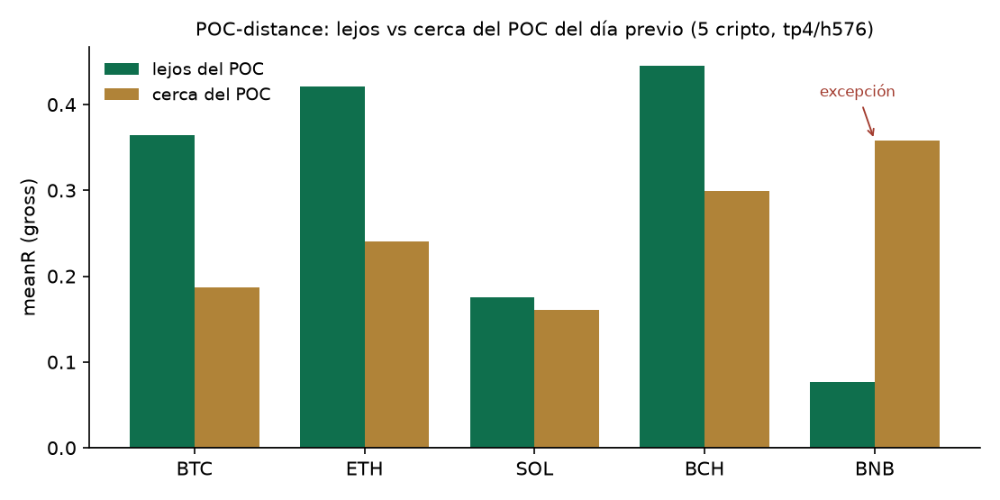

# Ventajas de econofísica estadísticamente validadas en derivados cripto

### Una revisión del motor de señales FQ y su metodología anti-sobreajuste

**Estado:** preprint / borrador de trabajo. Revisión metodológica abierta; las figuras y resultados son
reproducibles desde el repositorio fuente. A endurecer (apéndice de datos completo, DOIs) antes de someter
a revista.

**Autor:** RasDG (Ciudad de México), con asistencia de ingeniería de FQ.
**Fecha de corte:** 2026-07-03.

---

## Resumen

Presentamos **FQ**, un motor de señales direccionales para futuros perpetuos de criptomonedas construido
sobre el programa de la **econofísica** y validado con el estándar moderno anti-sobreajuste de las finanzas
cuantitativas — el **Deflated Sharpe Ratio (DSR)**, la **Validación Cruzada Combinatoria Purgada (CPCV)** y
la **Probabilidad de Sobreajuste del Backtest (PBO)** (López de Prado). A diferencia de la mayoría de los
sistemas retail — que no reportan corrección por pruebas múltiples — FQ somete **cada** ventaja candidata a
un gate estadístico explícito y mide el desempeño *forward* (fuera de muestra, en vivo) antes de elevar la
convicción. Esta revisión documenta (i) la metodología de validación como columna vertebral del sistema;
(ii) las ventajas que **sobreviven** al gate — flujo de órdenes con signo (CVD), persistencia del flujo
(memoria larga), detección de régimen por irreversibilidad temporal (divergencia KL), distancia al Point of
Control del perfil de volumen, y el **percentil del funding rate** como sesgo direccional; (iii) la separación
honesta entre una **capa heurística de convicción** y la **ventaja validada causalmente**; (iv) una extensión
*cross-asset* vía un desacople dato/venue hacia los mercados tradicionales; y (v) un cementerio explícito de
ideas refutadas. El principio operativo es uno solo: **medida o muerte.**

---

## 1. Introducción

La econofísica — la aplicación de métodos de la física estadística a los mercados (Mantegna y Stanley, 2000) —
produjo un núcleo robusto: colas pesadas, leyes de potencia, impacto de mercado tipo raíz cuadrada, memoria
larga del flujo de órdenes. El reto no es la escasez de fenómenos sino **separar la ventaja real, muestreable y
operacionalizable** del **artefacto de sobreajuste** y de la *envidia de la física* (importar el mecanismo
físico como decoración). FQ toma una postura estricta: una idea entra al motor solo si (a) pasa un gate que
**deflacta** por cuántas cosas se probaron, (b) **suma** dentro de las ventajas ya confirmadas (ortogonalidad),
y (c) se mide *forward* antes de cualquier decisión de capital o de convicción. Esta revisión mapea lo que
sobrevivió.

## 2. Metodología: el gate de validación

El núcleo del sistema no es dato nuevo — es **validación**. La razón es estadística: bajo pruebas múltiples,
probar ~20 configuraciones garantiza un resultado espurio "5% significativo". El **Deflated Sharpe Ratio**
(Bailey y López de Prado, 2014) corrige el Sharpe por el número de ensayos y por la no-normalidad
(asimetría/curtosis), y exige superar la vara real **DSR > 0.95**. Se complementa con **CPCV** (validación
cruzada combinatoria purgada, con embargo, para una estimación fuera de muestra sin fugas) y **PBO**
(probabilidad de sobreajuste del backtest; Bailey et al., 2017). FQ implementa las tres en
`tools/validation_gate.py` (stdlib + numpy). Es la palanca de mayor evidencia del proyecto: no genera alfa, la
**certifica**.

## 3. Las ventajas validadas

### 3.1 Flujo de órdenes con signo (CVD)
El Cumulative Volume Delta (volumen de compra agresiva menos venta agresiva) da el **signo** del flujo. Su base
física es la **ley de impacto tipo raíz cuadrada** (el precio se mueve como σ·√(Q/V)), confirmada en cripto
(Donier y Bonart, 2015) y reconfirmada recientemente (Sato y Kanazawa, *PRL* 2025). En el cubo cosechado, el
subconjunto CVD-confirmado (desbalance ≥ 0.50) rinde **+0.27R (SOL) / +0.34R (BTC)** sobre cinco años de datos
tick, **DSR ✓** (≈1.00 BTC / ≈0.98 SOL). La ventaja es causal y gratis (aggTrades de Binance). *Trampa evitada:*
un resultado de +1.47R con n=17 fue descartado por el gate como espejismo de muestra pequeña.

### 3.2 Persistencia del flujo (memoria larga / partición de órdenes)
Las órdenes grandes se ejecutan en pedazos, generando **autocorrelación positiva del signo del flujo** (Lillo,
Mike y Farmer, 2005; Bouchaud, Farmer y Lillo, 2009). FQ mide la autocorrelación en lag-1 (F2). En BTC, el tier
premium (CVD✓ y F2✓) alcanza **DSR 0.995**. **Hallazgo honesto:** F2 es un confirmador **idiosincrático por
símbolo** (paga en 4 de 6 medidos; negativo en ETH), **no** una ley de escala universal — la hipótesis de que
"el premium escala con la institucionalidad" fue **refutada** (corr = −0.19).

### 3.3 Régimen por irreversibilidad temporal (KL)
La flecha termodinámica del tiempo: la divergencia KL entre las distribuciones de grado del **grafo de
visibilidad horizontal** calculado hacia adelante vs. hacia atrás mide la distancia al equilibrio — es decir,
producción de entropía (Kawai, Parrondo y Van den Broeck, 2007; Lacasa et al., 2012). **Sin parámetros libres.**
La ventaja vive en irreversibilidad **baja** (reversible / con reversión a la media): **BTC +0.348R DSR 0.999;
SOL +0.225R DSR 0.950**, monótona por cuartil y **cross-symbol**.

### 3.4 Distancia al Point of Control del perfil de volumen
La pieza más nueva de la cosecha original. El perfil de volumen del día previo define el **POC** y el *Value
Area*. FQ mide la distancia normalizada de la entrada al POC. La hipótesis — "no operes en el chop de ayer;
lejos del POC = tendencia" — **pasa el gate cross-symbol**: un pool de 5 criptos (n=5162) muestra uplift +0.121,
**ortogonal a KL** (within-KL +0.272), **CPCV OOS +0.111 (93% de las trayectorias positivas), PBO 0.17**. Se
sostiene en **4 de 5** símbolos; **BNB es la excepción medida** (far<near) y se excluye. Ver Apéndice B para el
resultado reproducible.

### 3.5 Percentil del funding rate (direccional)
La pieza más reciente y el **gate más fuerte del programa**. El funding de un perpetuo es el carry que ancla el
perp al spot; un funding alto = longs saturados (BIS WP1087 vincula el carry alto con el riesgo de crash; el
retail *trend-chaser* lo infla). **Hallazgo clave:** el **nivel crudo NO informa** (PBO 0.75), pero el
**percentil relativo a la propia historia de 90 días del símbolo SÍ**. Es direccional y asimétrico: **LONG con
funding frío** (pctl ≤ 0.5) → +0.173R vs +0.121 base (n=1538), **DSR 1.000, CPCV OOS +0.028 (80% de trayectorias
> 0), PBO 0.04**; **SHORT con funding caliente** (pctl ≥ 0.7) → +0.224R vs +0.156, **DSR 1.000, CPCV 100% de
trayectorias, PBO 0.00 — el mejor resultado de gate del programa**. El gradiente es monótono y limpio: los longs
se apagan conforme el funding se calienta (+0.175 → +0.095) y los shorts son el espejo. Se cableó por el **mismo
camino que el CVD**: gate ✓ → dormido (sellado como tag de régimen) → forward (juez `by_funding` en el ledger) →
producto (boost direccional de convicción). Nota cross-venue: validado sobre historia de Binance; en vivo cada
venue se compara contra su propia historia de 90 días (mismo constructo relativo).

## 4. Convicción vs. ventaja validada: la distinción honesta

FQ separa dos capas que la mayoría de los sistemas confunden. La **convicción** (`P_master`) es una heurística
estructurada — la razón áurea φ ponderada por confluencia, conceptos estructurales ICT (barridos de liquidez,
order blocks, fair-value gaps, killzones de sesión), una memoria de buckets aprendida κ, y un factor de *tiempo
emergente* σ_τ de un Monte-Carlo de trayectorias de precio. Es principiada pero **no** una ventaja causal
certificada. La **ventaja validada** es la capa que pasó DSR/CPCV/PBO (CVD, F2, KL, distancia-POC, funding) y se
mide forward. Confundir ambas es el origen del humo: la heurística **filtra y prioriza**; la ventaja validada
**decide**.

## 5. Extensión cross-asset: el desacople dato/venue

La ventaja es una propiedad del **activo**, no del venue. Para mercados tradicionales (oro, NASDAQ, S&P,
petróleo, plata), FQ valida sobre el registro histórico profundo y gratuito de un proveedor de datos y ejecuta
la señal en el perpetuo del exchange. Las features basadas en precio transfieren (KL, estructura base, la capa
ICT calibrada a NY); el flujo de órdenes (CVD/F2) **no** — pertenece al libro del venue. Preliminar: el motor
digiere OHLCV de mercados tradicionales y produce cubos con una ventaja base positiva; la distancia-POC muestra
la **misma dirección** que en cripto, aunque el gate completo sigue con poca potencia (n bajo) a la espera de
una cosecha mayor.

## 6. Resultados y cementerio

**Sobrevive y está cableado:** CVD (DSR ✓), F2 (DSR ✓, BTC), KL (DSR ✓ cross-symbol), distancia-POC (gate ✓
cross-symbol; Apéndice B), **percentil de funding direccional** (gate ✓; el mejor del programa, §3.5). **Pasa
pero es redundante:** F1 (residual de impacto; within-CVD negativo). **Medido y refutado en el mismo barrido (no
re-probar):** el gate de *breadth*/alt-season para longs de alts (uplift +0.002, PBO 1.00 — el decoupling macro
no baja a un gate de 5m; hay *horizon mismatch*); las métricas on-chain de valuación (NUPL) no superan el
protocolo de régimen lento (P = 0.941 < 0.95). **Refutado / infalsable (no codificado):** quantum finance de
Baaquie, LPPL de Sornette, mercados "quantum-like" de Khrennikov, alerta temprana por critical-slowing-down,
rough volatility (Cont y Das, 2022). Lo que el gate mató queda escrito — para que nadie vuelva a perseguir el
espejismo.

## 7. Discusión y limitaciones

Las cifras de los cubos son **brutas** (pre-costos) y dentro de muestra del periodo de cosecha; validadas con
CPCV/PBO, pero el juez final es **forward**. FQ mide forward en *papel* (0% capital) y exige ≥30–50 fills +
uplift + DSR antes de elevar la convicción de cara al cliente. La extensión a mercados tradicionales está
limitada por n (el horario de mercado ⇒ menos eventos). Ninguna de estas limitaciones es fatal; todas están
medidas y documentadas.

## 8. Conclusión

FQ no es un sistema de promesas: es un **programa para validar ventajas de econofísica** con un registro honesto
de qué pasó, sobre qué datos, en qué horizonte. Su aporte no es un alfa secreto sino una **metodología
reproducible** — tomar el núcleo robusto de la física estadística de mercados y correrlo por el gate
anti-sobreajuste más exigente del campo, *forward antes de creer*. En un dominio saturado de sobreajuste y humo,
eso, en sí mismo, es el resultado.

---

## Apéndice A — Linaje disciplinar

El perfil natural de quien construiría esto es un **físico o matemático aplicado convertido en quant** — el
camino quant clásico. Las piezas de FQ mapean a fundadores reales: DSR/CPCV/PBO → **López de Prado** (Cornell
ORIE / ADIA); impacto raíz cuadrada y flujo de órdenes → **Bouchaud** (CFM / École Polytechnique); partición de
órdenes con memoria larga → **Lillo, Mike, Farmer, Bouchaud** (Scuola Normale / Oxford / Santa Fe);
irreversibilidad y grafos de visibilidad → **Parrondo, Kawai, Van den Broeck; Lacasa**; el programa de la
econofísica → **Mantegna y Stanley**. Esto se enseña en los mejores programas del mundo (Cornell, Oxford,
Princeton, CMU, ETH). El giro: se hace de forma autodidacta desde Ciudad de México, y el entregable no es una
tesis en papel sino **un sistema en vivo, validado forward, con track record.**

## Apéndice B — Resultados reproducibles (distancia-POC)

Generado con `python tools/reproduce_gate_results.py` sobre los 5 cubos cripto (tp4/h576, bruto, usando el
**mismo** `gate_poc_distance` que valida en producción):

| Símbolo | n | far | near | uplift |
|---|---|---|---|---|
| BTC | 1005 | +0.364 | +0.187 | +0.177 |
| ETH | 1155 | +0.421 | +0.241 | +0.179 |
| SOL | 976 | +0.175 | +0.161 | +0.014 |
| BCH | 1503 | +0.445 | +0.299 | +0.146 |
| BNB | 523 | +0.077 | +0.358 | **−0.281** (excepción) |

**Pooled (n=5162):** uplift +0.121 · **DSR 1.000** · ortogonal a KL (within-KL +0.272) ·
**CPCV OOS +0.111 (93% de las trayectorias >0)** · **PBO 0.17** → **PASA**. 4/5 siguen el patrón
(`far>near`); BNB es la excepción medida y se excluye.

> Reproducible de punta a punta: `tools/gate_poc_distance.py` (gate) + `tools/reproduce_gate_results.py`
> (tabla + figura) sobre los cubos del repositorio. Las figuras son brutas / in-cube; el juez final es forward
> (§7).

## Referencias (preliminar — a completar)

- Bailey, D. y López de Prado, M. (2014). *The Deflated Sharpe Ratio.* J. of Portfolio Management.
- Bailey, D. et al. (2017). *The Probability of Backtest Overfitting.* J. of Computational Finance.
- López de Prado, M. (2018). *Advances in Financial Machine Learning.* Wiley.
- Bouchaud, J.-P., Bonart, J., Donier, J. y Gould, M. (2018). *Trades, Quotes and Prices.* Cambridge.
- Donier, J. y Bonart, J. (2015). *A Million Metaorder Analysis of Market Impact on Bitcoin.*
- Sato, Y. y Kanazawa, K. (2025). *Statistical mechanics of square-root market impact.* Phys. Rev. Lett.
- Lillo, F., Mike, S. y Farmer, J.D. (2005). *Theory for long memory in supply and demand.* Phys. Rev. E.
- Bouchaud, J.-P., Farmer, J.D. y Lillo, F. (2009). *How markets slowly digest changes in supply and demand.*
- Kawai, R., Parrondo, J.M.R. y Van den Broeck, C. (2007). *Dissipation: The phase-space perspective.* PRL.
- Lacasa, L. et al. (2012). *Time series irreversibility: a visibility graph approach.* Eur. Phys. J. B.
- Mantegna, R. y Stanley, H.E. (2000). *An Introduction to Econophysics.* Cambridge.
- Cont, R. y Das, P. (2022). *Rough volatility: fact or artefact?*
