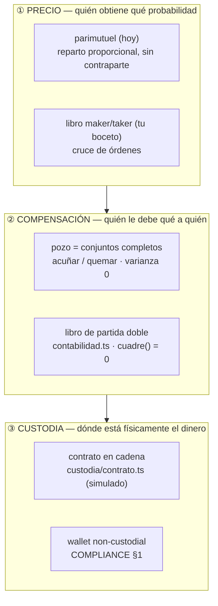
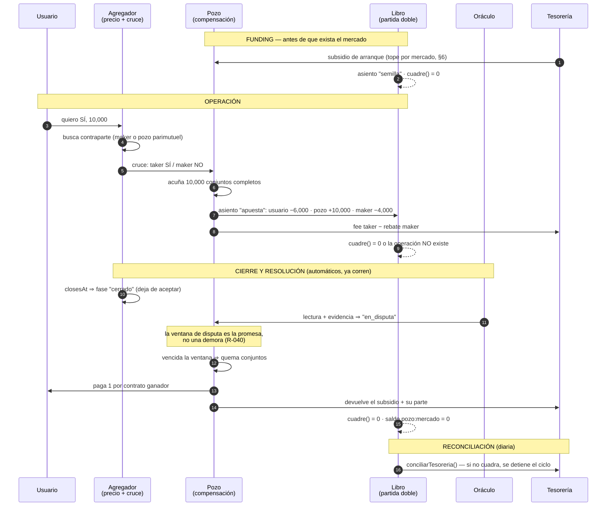

# LIQUIDEZ — el pozo, el funding y el ciclo automático

> Estado: **diseño**. Nada de esto está desplegado. La app corre hoy con
> `market_engine = "parimutuel_points"`, `FEE_BPS = 300` sobre el pozo y
> `eligibility` con todos los países en `pendiente`.
>
> Este documento existe para que la decisión de arquitectura se tome antes de
> escribir código, no después. Lo que se decida aquí se cablea en invariantes
> (§7), no en buenas intenciones.

**Para el equipo:** `vault/liquidez-flujo.png` es la aritmética y el camino de $0 a
plataforma activa en una imagen. Se regenera con `vault/liquidez-flujo.html`
(Chromium headless, ancho 1720, escala 2). La arquitectura en cadena —las tres pruebas,
el mapa de contratos y la cadena recomendada— está en `vault/cadena-arquitectura.png`.

La memoria durable de esta decisión vive en `MEMORY/marea/README.md`, y los **planos de
construcción** (7 páginas A3: sistema, árbol de época, ciclo, contratos, árbol de archivos
y orden de obra) en `MEMORY/marea/planos-construccion.pdf` — fuente en
`vault/planos-construccion.html`.

---

## 0. La ambigüedad que decide todo el resto

El boceto dice "el Pool actúa como arbitrador entre el taker y el maker". Esa
frase tiene dos lecturas que se parecen en el dibujo y no se parecen en nada en
el balance:

| | **(a) Cámara de compensación** | **(b) Creador de mercado** |
|---|---|---|
| Qué hace el pozo | Guarda el colateral de las dos partes y paga al que acertó | Cotiza los dos lados y se queda con lo que nadie tomó |
| ¿Toma posición? | **Nunca**. Por construcción no puede | Sí: el inventario neto es una apuesta |
| Varianza del capital propio | **Cero, exacta, por mercado** | Real. Vuelve al origen *en promedio*, no por mercado |
| ¿Vuelve el pozo al monto original? | Sí, siempre, con cualquier resultado | Sólo con suerte |
| ¿Sobrevive a R-057? | Sí | **No.** R-057 prohíbe que la casa tome el lado contrario |

**Lo que escribiste describe (a).** "Al final del mercado el monto de la pool
vuelve al original y sólo reparte los fees colectados" es la definición exacta
de una cámara de compensación, y es lo que hace verdadera la intuición de que
"la varianza es relativa".

**Lo que el dibujo puede leerse como (b)** es el agregador sentado entre el
taker y el pozo, decidiendo el precio. Si el agregador alguna vez rellena con
capital del pozo lo que ningún maker tomó, el pozo dejó de ser (a) y ninguna
línea de este documento se sostiene.

Todo lo que sigue construye (a) y pone las alarmas para que nadie derive a (b)
sin darse cuenta.

---

## 1. Por qué (a) tiene varianza cero: el conjunto completo

La pieza es vieja y aburrida, que es lo que uno quiere en la capa que guarda
dinero ajeno:

> **1 unidad de colateral ⇄ 1 contrato de _cada_ resultado.**

A eso se le llama un *conjunto completo*. El pozo sólo sabe hacer dos cosas:

- **acuñar** (`mint`): recibe 1 unidad, emite un contrato de cada resultado y
  los entrega a quienes los compraron;
- **quemar** (`burn`): al resolver, exactamente un resultado vale 1 y los demás
  valen 0. Paga 1 por contrato ganador y se queda con 0.

De ahí sale la aritmética que hace cierta tu frase:

```
colateral retenido      = contratos emitidos            (por la acuñación)
obligación máxima       = contratos emitidos            (exactamente uno paga)
⟹ P&L del pozo al resolver = 0, con cualquier ganador
```

No es "la varianza es baja". Es que **el resultado del mercado no entra en la
ecuación del pozo**. El pozo no sabe quién ganó; sólo sabe cuántos conjuntos
acuñó, y ese número no depende del oráculo.

### Tu ejemplo, con tus números

Evan (taker) quiere SÍ. Diego (maker) le pone el otro lado a 0.60 / 0.40.
Tamaño: 10,000 contratos. Taker fee 10 bps (tus `10,000 → 9,990`), rebate al
maker 4 bps, la casa se queda con 6.

| Momento | Evan | Diego | Colateral en pozo | Tesorería |
|---|---|---|---|---|
| Entra | −6,000 −10 fee | −4,000 +4 rebate | **+10,000** | +6 |
| Vive el mercado | | | 10,000 (quieto) | 6 |
| Resuelve **SÍ** | +10,000 | 0 | **0** | 6 |
| Resuelve **NO** | 0 | +10,000 | **0** | 6 |

Suma en cualquiera de las dos ramas: entró 10,000 de colateral, salió 10,000.
El **capital propio del pozo se movió cero** en ambos casos — que es
literalmente "el monto de la pool vuelve al original". La casa cobró 6 y los
cobró el día de la operación, no el día de la resolución.

Nota la distinción que hay que mantener separada en el libro y en la cabeza:

- **colateral en custodia** — dinero de terceros que pasa por el pozo. Sube y
  baja con el volumen. No es nuestro ni un segundo.
- **capital propio del pozo** — lo que la casa puso. En (a) es **cero** para
  compensar. Sólo aparece en la semilla (§6), y ahí sí tiene varianza.

Confundir estas dos cuentas es la forma clásica de quebrar un intermediario:
se siente solvente porque el colateral ajeno está en la misma caja.

---

## 2. Las tres capas (el arreglo estructural de verdad)

El motor parimutuel de hoy hace las tres cosas a la vez, y por eso el tema del
pozo se siente atorado: no hay dónde meter un maker sin reescribir la
liquidación.



La regla que sale de aquí, y que es el verdadero entregable de este documento:

> **El pozo pertenece a la capa ②, no a la ①.** No es un motor de precio
> alternativo al parimutuel: es la capa que hay *debajo* de los dos.

Eso también contesta el riesgo que R-044 marca ("dos implementaciones de la
misma matemática de dinero"). No habría dos motores de dinero: habría **un**
compensador con dos formas de fijar el precio encima. `settle()` de hoy pasa a
ser un *productor de reparto*, y quien mueve saldos es siempre el compensador.

---

## 3. El flujo completo



Los pasos de cierre, lectura, disputa y pago **ya existen y ya corren solos**:
`server/ciclo.mts` + `scripts/settle.mts` + `scripts/roll.mts`. Lo que este
diseño agrega no es el ciclo, es el **pozo y el funding por debajo del ciclo**.

---

## 4. Los asientos

Todo lo de arriba se expresa en el libro que ya existe (`src/domain/contabilidad.ts`).
Ningún tipo nuevo hace falta salvo `rebate`:

| Hecho | Patas | Invariante que verifica |
|---|---|---|
| Depósito | `entrada −X` · `usuario:u +X` | `cuadre() = 0` |
| Semilla | `tesoreria −S` · `pozo:m +S` | `S ≤ SUBSIDIO_MAX` |
| Operación | `usuario:taker −(p·q + fee)` · `usuario:maker −((1−p)·q − rebate)` · `pozo:m +q` · `tesoreria +(fee − rebate)` | `pozo:m == conjuntos(m)` |
| Liquidación | `pozo:m −q` · `usuario:ganador +q` | `pozo:m == 0` después |
| Devolución | `pozo:m −q` · `usuario:* +q` | idem, sin comisión (R-024) |
| Retiro | `usuario:u −X` · `salida +X` | `saldo(u) ≥ 0` |

El detalle que importa y que ya nos mordió una vez (R-064): **el fee se asienta
en el mismo asiento que lo genera**. No hay un paso posterior que "cobre" nada.
Un fee que se calcula en un lado y se acredita en otro momento es exactamente
la comisión que se restaba del reparto y no llegaba a ninguna parte.

---

## 5. Fees: la base, la escalera y la regla de bajada

### 5.1 Sobre qué se cobra

Dos bases posibles, y no son equivalentes:

- **Sobre el nocional** (los contratos): un fee plano sobre `q`. Castiga los
  precios extremos — a `p = 0.02`, 10 bps del nocional son **5% de la prima**
  que el usuario puso.
- **Sobre la prima** (lo que efectivamente entra): `f · q · p` al taker,
  `r · q · (1−p)` de rebate al maker. Neutral al precio, y es lo que ya
  describe el boceto: `10,000 → 9,990`.

**Decidido: sobre la prima.** El compensador de §1 no depende de esta elección
—cobra donde le digan— pero el copy y la incidencia sí.

### 5.2 La aritmética del ingreso

```
V          volumen de prima cruzada en el periodo
f          fee al taker (bps)        r   rebate al maker (bps)
Ingreso  = V · (f − r)
R        = V / colateral vivo        ← rotación: cuántas veces gira el capital
```

Y la ecuación de arriba abajo, para poner números propios:

```
V = U · t · k         U usuarios activos/mes · t ticket · k operaciones/usuario
Ingreso   = V · f
Equilibrio: V ≥ (M · S + G) / f      M mercados · S subsidio · G coste en cadena
```

Ejemplo aritmético (no un pronóstico): `U=5,000 · t=$25 · k=6` ⇒ `V=$750,000/mes`.
A 300 bps son **$22,500/mes**; ese mismo volumen a 6 bps son **$450/mes**.

### 5.3 La escalera

| Fase | Cuándo | Taker | Rebate | Neto | Rotación que exige |
|---|---|---|---|---|---|
| **A · arranque** | hoy · sin libro, sin makers | 300 bps | — | 300 | ninguna |
| B · libro joven | cuando exista libro con dos lados | 100 bps | 40 bps | 60 | R ≥ 5× |
| C · líquido | el boceto · mercado que rota | 10 bps | 4 bps | 6 | R ≥ 50× |

**La regla de bajada, que es el invariante de esta sección:**

```
bajar de f₀ a f₁  ⟺  R_medida ≥ f₀ / f₁
```

De 300 a 60 bps hacen falta 5×; de 300 a 6, cincuenta. La escalera no se salta
y no se baja con ganas: se baja con la medición de ocho semanas (paso 08 de §5.4).

### 5.4 Por qué la fase A no es un cambio de precio

Hoy el 3% sale del pozo **antes de repartir**, así que cada apostador ya
financia el 3% de su parte. Cobrarlo al cruzar es **la misma incidencia movida
en el tiempo**: mismo quién, mismo cuánto. Lo que compra el cambio es que el
ingreso deja de depender del resultado y del reparto — y eso es lo que hace
continuo el salto a B y a C, en vez de una reescritura.

Dos cosas que no cambia y hay que decir en el copy (R-011): en anulación
(R-059) y cuando nadie acierta (R-024) **se devuelve todo, fee incluido**; y la
casa sigue sin tomar el lado contrario, que es lo que sostiene la promesa.

---

## 5bis. El camino de $0 a plataforma activa

Nueve pasos, tres tramos. El único que no depende de nosotros es el que separa
el 0 del primer peso.

**Tramo A · cablear** — se puede hacer hoy, en puntos, sin tocar la puerta de
elegibilidad:

1. Compensador puro (`domain/pozo.ts`) — *puerta:* mil secuencias aleatorias
   dejan el capital propio idéntico.
2. Asientos cableados — *puerta:* `cuadre() = 0` en toda operación.
3. Funding con freno — *puerta:* sin presupuesto no se crea mercado.

**Tramo B · abrir** — aquí está el bloqueo real:

4. **Opinión legal por país.** No es código. Sin esto no hay dinero.
5. Pozo en contrato · USDC en L2 — *puerta:* el colateral se lee en cadena.
6. Depósito y retiro non-custodial (`COMPLIANCE.md` §1).

**Tramo C · cobrar y medir** — el dinero empieza aquí:

7. Fee al cruzar, 300 bps (fase A de §5.3). Primer peso facturado.
8. Medir R durante ocho semanas.
9. Bajar a taker/maker sólo si `R ≥ f₀/f₁`.

La cifra que decide todo es `V`, y `V` hoy es 0. Por eso el trabajo está en el
tramo B, no en afinar el fee.

---

## 6. Funding: el pozo no necesita capital; la primera cotización sí

Aquí está la parte contraintuitiva y buena:

> **Una cámara de compensación necesita cero capital para compensar.** Todo el
> colateral lo ponen las dos partes.

El capital hace falta para una sola cosa: que el mercado no esté vacío cuando
llega el primer usuario. Y ahí choca de frente con R-057 — la casa **no puede**
tomar el lado contrario para dar liquidez. Las salidas honestas son tres:

**DECIDIDO (2026-09-01, RasDG): subsidio declarado, y la semilla de hoy se convierte
en subsidio.** Lo que sigue queda como registro de las alternativas descartadas.

| Opción | Cómo funciona | Varianza | Veredicto |
|---|---|---|---|
| **Subsidio declarado** | La casa pone S al mercado. S se reparte entre quienes acierten, pase lo que pase. Es un premio, no una posición: la casa nunca cobra de S | Coste **conocido y acotado** = S. Nunca gana | **Recomendada.** Es lo único que no puede ganarle al usuario |
| **LPs de terceros** | Un tercero pone el inventario y cobra el rebate del maker. La varianza es suya y la conoce | Real, de ellos | Viable después, con divulgación explícita |
| **Sin semilla** | Parimutuel: no hace falta contraparte, por eso se eligió | Cero | Lo de hoy. Sigue siendo la respuesta si el libro no rota |

Ojo con la semilla de hoy: `SEED = 100` entra al pozo como apuesta y `settle()`
reparte incluyendo el lado ganador entero, semilla incluida. Es decir, **la
semilla actual sí puede "ganar"** cuando cae del lado correcto. R-059 tapa el
caso escandaloso (un solo apostador ⇒ se anula todo), pero conceptualmente la
semilla de hoy es una posición pequeña, no un subsidio. Si se adopta el modelo
de subsidio, esa parte hay que cambiarla explícitamente: la porción de la
semilla que le tocaría cobrar se redistribuye entre los usuarios ganadores en
lugar de volver a tesorería.

### 6.1 Qué cambia exactamente al convertir la semilla en subsidio

Hoy la semilla entra al pozo como apuesta y `settle()` la incluye en el denominador
del lado ganador, así que su parte del reparto **se queda en el pozo — la casa la
cobra**:

```
hoy        winnerStake = Σ apuestas ganadoras + semilla_ganadora
           payout_i    = stake_i / winnerStake × distributable

subsidio   usuariosGanadores = winnerStake − semilla_ganadora
           payout_i          = stake_i / usuariosGanadores × distributable
```

**El multiplicador tiene que moverse en el mismo commit.** `payoutMultiplier` divide
hoy por `outcomeStake(id) + stake`; con subsidio divide por
`outcomeStake(id) − semilla(id) + stake`. Si sólo cambia `settle()`, la app muestra
**menos** de lo que paga — que sigue siendo mentir, aunque sea en la dirección
generosa (R-023, R-044).

*El test que lo fija:* para cualquier pozo y cualquier apuesta, `quote(...).toWin`
es exactamente `settle(...).payouts[esa apuesta]` cuando ese lado gana. Es la versión
ejecutable de R-044.

*Casos borde:* si el lado ganador sólo tiene semilla —ningún usuario acertó— el
denominador es cero: se devuelve todo sin comisión, como hoy (R-024), y la semilla
vuelve a tesorería. R-059 sigue anulando el mercado de un solo apostador.

*El coste que compra la frase:* hoy la semilla **vuelve** cuando cae del lado
ganador. Como subsidio no vuelve nunca: **cuesta S en todos los mercados, gane quien
gane.** Con puntos da igual; con dinero, es exactamente el número que el tope de L9
tiene que acotar. Por eso el freno deja de ser opcional.

*La trampa de migración:* **no se aplica a mercados ya abiertos.** Cambiaría el
multiplicador que ya se le mostró a quien apostó. Va como campo de la semilla
(`seedMode: "apuesta" | "subsidio"`), y cada mercado termina con las reglas con las
que nació.

**Presupuesto y freno**, en el espíritu del `FQ_MOTOR_MAX_DD` del bot:

```
MAREA_SUBSIDIO_MAX_MERCADO   tope por mercado
MAREA_SUBSIDIO_MAX_ABIERTO   suma de subsidios vivos a la vez
MAREA_EXPOSICION_MAX         si se cruza, roll.mts deja de crear mercados
```

Un tope que no apaga nada es un comentario. El freno tiene que estar en el
camino de creación, no en un tablero.

---

## 7. Invariantes

La regla del repo: *un hallazgo sin invariante que lo haga cumplir es una nota,
no un arreglo*. Estas son las que hay que cablear, con el test que las fija.

| # | Invariante | Dónde | Test que falla si vuelve |
|---|---|---|---|
| **L1** | **Neutralidad**: `colateral(m) == conjuntos_emitidos(m)` en todo momento | `domain/pozo.ts` | Propiedad: cualquier secuencia de cruces × cualquier ganador ⇒ `capital_propio` idéntico antes y después |
| **L2** | El pozo **nunca** es contraparte. No existe función que le abra posición neta | `domain/pozo.ts` | No hay API para ello + test que afirma `exposicion_neta(m) == 0` |
| **L3** | Fee y colateral **no comparten cuenta**. El fee se asienta en el mismo asiento que lo genera | `contabilidad.ts` | `saldoDe(libro, "pozo:m") == 0` tras liquidar, con fee > 0 |
| **L4** | `cuadre(libro) == 0` **antes y después** de toda operación, o la operación no ocurre | `contabilidad.ts` (ya está) | `contabilidad.test.ts` (ya existe) |
| **L5** | **Conservación**: `Σ pagos + fees == Σ colateral` | `pozo.ts` + `ciclo.mts` | Propiedad sobre mercados de N resultados |
| **L6** | **Idempotencia**: liquidar dos veces paga una vez | `ciclo.mts` | Correr `correrCiclo` dos veces ⇒ `acreditado` igual |
| **L7** | Ninguna fase se salta; no se paga con la disputa abierta | `settlement.ts` (ya está) | `settlement.test.ts` (ya existe) |
| **L8** | **Frescura del oráculo**: una fuente parada no resuelve. Sin dato ⇒ se reintenta, nunca se inventa | `settlement.ts` (parcial) | Falta: test de lectura vieja ⇒ no avanza de fase |
| **L9** | El subsidio vivo nunca excede el presupuesto; cruzarlo **detiene la creación** | `roll.mts` | Test: presupuesto agotado ⇒ `roll` no escribe mercados nuevos |
| **L10** | `saldo(usuario) ≥ 0` siempre. Se bloquea el monto antes de cruzar, no después | `store.mts` | Test: dos apuestas concurrentes con saldo para una sola |

L4 y L7 ya están vivas. L1, L2, L3, L5 son el trabajo nuevo. **L8 es una deuda
existente** que no depende de nada de esto: hoy `onRead` acepta una lectura sin
comprobar cuán vieja es la fuente, que es el mismo fallo que en el bot obligó a
`cvd_confirmation`.

---

## 8. Dónde se enchufa en lo que ya corre

Nada de esto pide un ciclo nuevo. Pide tres injertos en el que ya existe:

| Ya existe | Qué se le agrega |
|---|---|
| `scripts/roll.mts` — crea el catálogo de la semana | Consulta el presupuesto de subsidio antes de escribir. Sin presupuesto, no crea (L9) |
| `server/ciclo.mts` — cierra, lee, disputa, paga | El reparto lo aplica el compensador, no `store.pagarMercado` directo. Verifica L5 antes de acreditar |
| `scripts/settle.mts` — el liquidador idempotente | Sin cambios de fondo; hereda L6 que ya tiene de facto |
| `scripts/daily.mjs` — las tres tareas de mantenimiento | Cuarta tarea: `cuadre()` + `conciliarTesoreria()`. Si no cuadra, **apaga la creación** y lo dice |
| `npm run validate` | L1–L3, L5, L9 entran al VALIDATION_REPORT como puertas |

---

## 9. Plan por fases

Cada fase termina en un test, no en un documento.

**L0 · Decidir (a) por escrito.** Este documento + la regla nueva en `RULINGS.md`.
Sin código. *Cierra cuando:* R-065 está escrita y `validate` la cuenta.

**L1 · El compensador puro.** `src/domain/pozo.ts`: acuñar, quemar, exposición.
Funciones puras, sin estado, sin red. Test de propiedad de L1/L2/L5 con
secuencias aleatorias de cruces y ganadores.
*Cierra cuando:* mil secuencias aleatorias × cualquier ganador dejan el capital
propio idéntico al centavo.

**L2 · Cablear los asientos.** El parimutuel de hoy pasa a mover saldos **a
través** del compensador. Cero cambios de comportamiento visible: los pagos
salen idénticos a los de hoy. Es refactor con red, no producto.
*Cierra cuando:* la suite de 269 pruebas pasa sin tocar sus expectativas.

**L3 · Funding con freno.** Subsidio, presupuesto, tope, y `roll.mts` que se
detiene solo. Sigue en puntos.
*Cierra cuando:* con el presupuesto agotado, `roll` no crea y lo dice.

**L4 · Libro maker/taker (opcional, y sólo si L3 mide rotación).** Aquí y sólo
aquí entra el agregador de tu boceto, como capa ① encima del mismo compensador.
*No se empieza sin el dato de rotación de L3.* Con la rotación de hoy, el
resultado de §5 dice que pierde dinero.

Todo L0–L3 corre en modo puntos y **no toca la puerta de elegibilidad**. Se
construye contra la puerta cerrada, como manda `PROMPT_DINERO_REAL.md`.

---

## 10. Lo que no decido yo

1. **¿Se acepta la escalera de §5.3?** La base (sobre la prima) y la regla
   (`R ≥ f₀/f₁`) son aritmética; los peldaños 300 / 100-40 / 10-4 son una
   propuesta. Lo que no es negociable es el orden: primero se mide R, después
   se baja.
2. ~~**¿Subsidio o LPs?**~~ **Decidido 2026-09-01: subsidio declarado.** Los LPs
   quedan para después; reabren `COMPLIANCE.md` §2 entero.
3. ~~**¿La semilla se convierte en subsidio?**~~ **Decidido 2026-09-01: sí.** Ver
   §6.1 — cuesta S siempre, y el multiplicador se mueve con ella.
4. ~~**¿Base o Polygon?**~~ **Decidido 2026-09-01: Base.** Tron entra sólo como
   rampa de depósito, con conversión a USDC al entrar.
5. **¿El pozo vive en un contrato?** `custodia/contrato.ts` ya tiene la forma.
   La respuesta no es técnica y sigue esperando opinión legal por país.

---

## 12. Lo que falta y cuánto tarda (2026-09-01)

### 12.0 El agujero del árbol: inclusión ≠ completitud

Una raíz de Merkle prueba que **tu** hecho está en el libro. **No prueba que el libro
esté completo.** Si un hecho se omite entero, la raíz sigue verificando para todos los
demás y nadie lo nota. Es el problema clásico de disponibilidad de datos, y el diseño
actual no lo cubre.

Se tapa con tres cosas baratas, y hay que decidirlas **antes** de escribir el anclaje:

1. **Secuencia por usuario.** Cada hoja lleva `(usuarioId, n)` consecutivo. Un hueco
   —falta el `n=7`— es detectable por el propio usuario sin ver el resto del libro.
2. **Conteo anclado.** La tx de época publica también el número de hojas. No se puede
   encoger el libro en silencio.
3. **Hojas disponibles.** El conjunto completo de hojas de la época se publica (o se
   sirve bajo demanda). Sin eso, "auditable" depende de que nosotros contestemos.

Además, dos detalles de construcción que si se olvidan hacen el árbol falsificable:
**separación de dominio** (prefijo distinto al hashear hoja `0x00` y nodo interno `0x01`,
o un atacante hace pasar un nodo por hoja) y **regla explícita para número impar de
hojas** (duplicar la última o promoverla — cualquiera, pero escrita).

→ **L15 · una omisión es detectable.** Secuencia por usuario + conteo en el ancla.
*Test:* borrar una hoja del libro rompe la verificación de alguien.

### 12.1 Lo que falta, por bloque

Marcado con **[$]** lo que sólo bloquea el día del dinero, y **[P]** lo que además
bloquea el lanzamiento en puntos.

**Contratos y seguridad**
- **[$] Auditoría externa del contrato.** Un contrato que custodia dinero ajeno no se
  lanza sin ella. Tiene cola: no es tiempo de trabajo, es tiempo de calendario.
- **[$] ¿Actualizable o inmutable?** Si es proxy, quien puede actualizar puede robar.
  Con timelock largo + multisig, o inmutable y se despliega otro. **Sin decidir.**
- **[$] La multisig de verdad:** quiénes firman, cuántos, llaves en hardware, qué pasa
  si uno pierde la suya. Sin esto, "multisig + timelock" es una palabra en un diagrama.
- **[$] Pausa de emergencia.** Debe poder parar la **creación** de mercados, nunca la
  **redención**: un botón que congela retiros contradice el no-custodial.
- **[$] Confirmaciones y reorgs** en Base antes de dar por buena una liquidación.
- **[$] Economía de la disputa:** quién pone el bono, quién paga si se pierde, qué pasa
  si un resultado incorrecto **no** se disputa.

**Producto y rampa**
- **[$] Abstracción de gas.** Si el usuario necesita ETH en Base para firmar, se pierde
  al neófito, que es justo nuestro público. Paymaster / cuenta abstracta es **un bloque
  de trabajo entero que no estaba en el plan.**
- **[$] Wallet embebida:** proveedor (Privy/Turnkey), coste, dependencia. Sin elegir.
- **[$] On-ramp fiat** (MXN/COP/ARS → USDC) y **off-ramp**, que suele ser lo difícil.
  La rampa TRC20 sirve a quien ya tiene cripto, no al que llega de cero.
- **[$] Recuperación de cuenta con wallet propia.** El código de recuperación de hoy
  cubre la cuenta, no la llave.

**Legal — el camino crítico**
- **[$] Opinión por país.** Empezar por **uno**. Semanas, no días, y no depende de
  nosotros.
- **[$] Estructura societaria:** qué entidad opera y dónde.
- **[$] KYC/AML y screening de sanciones.** No aparece en ningún documento todavía y es
  obligatorio en cuanto hay dinero.
- **[$] Términos, privacidad, y disputa del usuario** (distinta de la del oráculo).

**Operación**
- **[P] Vigilante externo de L14:** un proceso fuera del sistema comparando
  `supply(conjuntos)` contra `balance(colateral)` y gritando. Está como test; falta como
  servicio.
- **[P] Runbook:** qué se hace con un mercado `atorado` con dinero dentro, con la fuente
  caída, con el formato del oráculo cambiado.
- **[$] Soporte humano.** Alguien contesta "no me llegó mi pago" a las 3am.
- **[$] Fondo de contingencia** para el día que haya un bug.

### 12.2 Cuánto tarda

Tres pistas que corren en paralelo. La de código es la única que controlamos.

| Pista | Trabajo | Empieza |
|---|---|---|
| **Código** | Tramo A (L1–L3 + semilla→subsidio) ≈ 4–6 semanas · contratos + anclaje ≈ 4–6 · wallet/gas/rampa ≈ 3–5 · endurecimiento y vigilante ≈ 2 | hoy |
| **Auditoría** | 6–11 semanas **desde que el contrato se congela** (cola + revisión + remediación) | tras congelar |
| **Legal** | Opinión del primer país 4–12 semanas · sociedad 4–8 | **hoy, en paralelo** |

**Lanzamiento en puntos con la cámara nueva: 6–8 semanas.** Sin bloqueo legal, sin
auditoría, sin rampa. Es alcanzable y no depende de nadie externo.

**Lanzamiento con dinero real: 7–9 meses realista** (5–6 optimista) — y el reloj no lo
marca el código, lo marca la opinión legal más la auditoría. Si la conversación legal
no empieza esta semana, el estimado corre día por día.

**Bajar el fee (paso 09): +8 semanas después de tener volumen**, no después de lanzar.

### 12.4 La ruta cripto-nativa (sin fiat) — 2026-09-01

Saltar rampa fiat, KYC y screening cambia el calendario de verdad. El usuario llega con
su USDC en Base y su wallet; nosotros no tocamos banco.

**Lo que se ahorra, y por qué es tanto:**

| Se salta | Semanas |
|---|---|
| On-ramp + off-ramp fiat | 3–5 |
| Wallet embebida (el usuario trae la suya) | 2–3 |
| **Abstracción de gas / paymaster** — el cripto-nativo ya tiene ETH en Base | 3–5 |
| KYC | 2–4 |
| **Total** | **10–17 semanas** |

**Dos cosas que NO se saltan aunque se salte todo lo demás:**

1. **El screening de sanciones.** No es KYC. Es una lista de direcciones bloqueadas en el
   frontend, y es lo único de este bloque que ha hundido equipos cripto de verdad. Cuesta
   **2–3 días**, no una pista de trabajo. Saltarlo no acorta el calendario; sólo compra
   riesgo. Se queda.
2. **Seguir siendo el operador.** Ponemos el frontend, creamos los mercados y operamos el
   oráculo. Cripto-nativo y no custodial reduce exposición; no la vuelve cero, y en varias
   jurisdicciones un mercado de predicción es lo que es sin importar el riel. La pregunta
   legal cambia de forma, no desaparece.

**Los bloques de construcción** (una persona con Claude):

| Bloque | Semanas |
|---|---|
| A · Tramo A en TS: compensador, asientos, freno, semilla→subsidio | 3–5 |
| B · Contratos: **CTF ya auditado** + adaptador de oráculo + registro de anclas + bóveda con tope | 3–5 |
| C · Wallet conectada + EIP-712 + liquidación | 2–3 |
| D · Anclaje Merkle + L15 + verificador público | 1.5–2 |
| E · Vigilante externo de L14 + runbook + observabilidad | 1–1.5 |
| F · Endurecimiento + testnet pública + bug bash | 2–3 |

La decisión que más ahorra está en el bloque B: **escribir la menos Solidity posible.**
Los Conditional Tokens de Gnosis ya están auditados y rodados; lo nuestro son 300–600
líneas (adaptador de oráculo, registro de anclas, bóveda con tope). Cuanto menos código
propio, más corta la auditoría y más barata.

**Los tres hitos:**

| Hito | Qué es | Cuándo |
|---|---|---|
| **M1 · testnet** | Todo el flujo en cadena sobre Base Sepolia, dinero de juguete. Auditable de punta a punta | **8–10 semanas** |
| **M2 · mainnet con tope** | USDC real en Base, **tope duro de colateral en el contrato** + bug bounty público, auditoría corriendo en paralelo | **13–15 semanas** (~3–3.5 meses) |
| **M3 · tope levantado** | Tras auditoría y remediación | **20–26 semanas** (~5–6 meses) |

**M2 es la respuesta a "live sin fiat".** El tope duro es lo que la hace defendible: el
contrato se niega a retener más de X USDC en total, así que la pérdida máxima de un bug
está acotada por diseño y no por confianza. Es el mismo principio que el tope de subsidio
de L9, aplicado al riesgo de contrato. Lanzar sin auditoría **y** sin tope no es rápido,
es barato de otra manera.

**El coste comercial, dicho una vez:** sin rampa, el público es "el que ya tiene USDC en
Base". En Latam eso es mucho más chico que "el que tiene USDT en Tron", y muchísimo más
chico que el neófito para el que se diseñó el producto (`README.md`: *nuestro público es
justo el neófito*). La rampa TRC20→USDC decidida el 2026-09-01 lo tapa a medias y añade
**1–2 semanas** más un puente con su propio riesgo en tránsito. Cripto-nativo es una vía
legítima de lanzar; es otra audiencia, no la misma más rápido.

### 12.5 Con rampa cripto (USDT-TRC20 → USDC-Base), sin fiat — 2026-09-01

Es el caso realista para Latam: el usuario no viene de un banco, viene con **USDT en
Tron**, que es el riel que de verdad usa.

**La decisión que hay que tomar antes de estimar nada**, porque cambia lo que somos:

| Forma | Qué pasa | Veredicto |
|---|---|---|
| **Integración** — el usuario firma, los fondos van `usuario → puente → su dirección en Base`. Nunca pasan por nosotros | Seguimos no custodiales. L12 y R-065 intactos | **Ésta** |
| **Dirección de depósito** — "manda a esta cuenta y te acreditamos" | **Nos vuelve custodios en la pata de Tron.** Tira abajo toda la historia no custodial, aunque la bóveda de Base siga siendo perfecta | **No** |

La segunda es más fácil de construir y por eso es la trampa. Un producto no custodial con
una rampa custodial es un producto custodial con un diagrama bonito.

**Lo que cuesta** (integración, no dirección de depósito): **2–3 semanas**. Uno o dos días
son el camino feliz; el resto son los caminos que fallan — puente caído, llegó menos de lo
que mandó, se quedó a medias, slippage declarado antes de firmar. `domain/solicitudes.ts`
ya modela depósitos como solicitudes con estado, que es exactamente la pieza que hace
falta: el trabajo es el adaptador y el monitoreo, no la máquina de estados.

La pata de vuelta (retirar a Tron) es **+1–2 semanas** y es la más delicada. Si no se
construye, se sale como USDC en Base y hay que decirlo antes del primer depósito.

**El calendario:**

| Hito | Sin rampa | **Con rampa cripto** |
|---|---|---|
| M1 · testnet completa en cadena | 8–10 sem | **8–10 sem** (la rampa no entra en testnet) |
| M2 · mainnet con tope + bounty | 13–15 sem | **15–18 sem ≈ 4 meses** |
| M3 · tope levantado tras auditoría | 20–26 sem | **22–29 sem ≈ 5–6.5 meses** |

**Construido y lanzado: ~4 meses** (M2, con tope duro y rampa de entrada). Con la pata de
retiro a Tron, 4–4.5.

**La rampa es el bloque más paralelizable de todo el plan.** No toca contrato, ni
invariante, ni matemática de liquidación: es adaptador y monitoreo. Con una sola persona
suma 2–3 semanas al calendario; con un segundo par de manos cuesta **cero**, porque cabe
entera en la ventana en que la auditoría está corriendo. Si en algún momento hay
presupuesto para una segunda persona, éste es el trabajo que hay que darle — no los
contratos.

**Dependencia declarada:** el puente es un tercero en el camino de entrada del dinero. Si
se cae, los depósitos paran; el pozo y los pagos siguen. La app lo dice en vez de fingir
(R-022).

### 12.3 La jugada que acorta todo

**Lanzar en puntos con la arquitectura nueva ya cableada, y medir R ahí.**

La rotación no necesita dinero para medirse. Si la gente opera con puntos, en ocho
semanas tenemos `R` y llegamos al día del dinero con el fee **elegido en vez de
adivinado** — que es justo lo que hoy no podemos hacer.

Con una salvedad honesta: con puntos la gente rota **más** que con dinero. La R medida
en puntos es un techo optimista. Sirve para **descartar** (si ni con puntos rota, con
dinero menos) y no para confirmar. Aun así, descartar barato es exactamente lo que este
repo hace bien.

---

## 11. Reglas escritas en `RULINGS.md` (2026-09-01)

- **R-065** ✔ escrita — El pozo es cámara de compensación, nunca creador de mercado. Sólo
  acuña y quema conjuntos completos, y su exposición neta a cualquier resultado
  es cero por construcción. Un pozo que puede ganar cuando el usuario pierde es
  la casa disfrazada de infraestructura. *(liquidez)*
- **R-066** ✔ escrita — El colateral de terceros y el capital propio son cuentas
  distintas y nunca se netean. Sentirse solvente con dinero ajeno en la misma
  caja es cómo quiebra un intermediario. *(contabilidad)*
- **R-067** ✔ escrita — Toda liquidez que la casa aporta es subsidio declarado con tope,
  y nunca cobra: se reparte entre quienes aciertan. El coste se conoce antes de
  ponerlo, no después. *(liquidez)*
- **R-068** ✔ escrita — Si el libro no cuadra, se dejan de crear mercados. Un descuadre
  con mercados nuevos encima es un descuadre que ya no se puede rastrear.
  *(contabilidad)*
