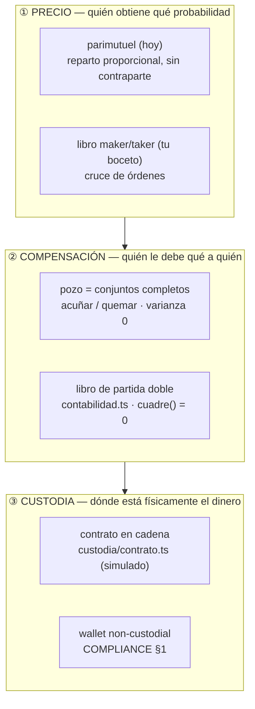
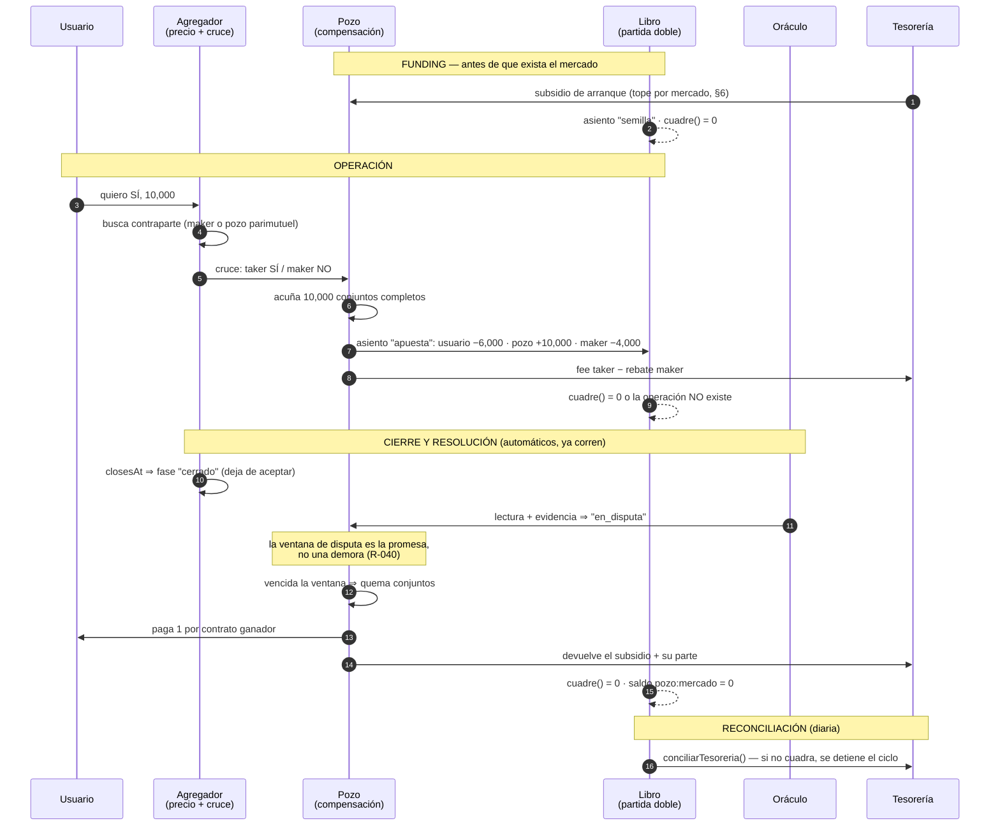

# LIQUIDEZ — el pozo, el funding y el ciclo automático

> Estado: **diseño**. Nada de esto está desplegado. La app corre hoy con
> `market_engine = "parimutuel_points"`, `FEE_BPS = 300` sobre el pozo y
> `eligibility` con todos los países en `pendiente`.
>
> Este documento existe para que la decisión de arquitectura se tome antes de
> escribir código, no después. Lo que se decida aquí se cablea en invariantes
> (§7), no en buenas intenciones.

---

## 0. La ambigüedad que decide todo el resto

El boceto dice "el Pool actúa como arbitrador entre el taker y el maker". Esa
frase tiene dos lecturas que se parecen en el dibujo y no se parecen en nada en
el balance:

| | **(a) Cámara de compensación** | **(b) Creador de mercado** |
|---|---|---|
| Qué hace el pozo | Guarda el colateral de las dos partes y paga al que acertó | Cotiza los dos lados y se queda con lo que nadie tomó |
| ¿Toma posición? | **Nunca**. Por construcción no puede | Sí: el inventario neto es una apuesta |
| Varianza del capital propio | **Cero, exacta, por mercado** | Real. Vuelve al origen *en promedio*, no por mercado |
| ¿Vuelve el pozo al monto original? | Sí, siempre, con cualquier resultado | Sólo con suerte |
| ¿Sobrevive a R-057? | Sí | **No.** R-057 prohíbe que la casa tome el lado contrario |

**Lo que escribiste describe (a).** "Al final del mercado el monto de la pool
vuelve al original y sólo reparte los fees colectados" es la definición exacta
de una cámara de compensación, y es lo que hace verdadera la intuición de que
"la varianza es relativa".

**Lo que el dibujo puede leerse como (b)** es el agregador sentado entre el
taker y el pozo, decidiendo el precio. Si el agregador alguna vez rellena con
capital del pozo lo que ningún maker tomó, el pozo dejó de ser (a) y ninguna
línea de este documento se sostiene.

Todo lo que sigue construye (a) y pone las alarmas para que nadie derive a (b)
sin darse cuenta.

---

## 1. Por qué (a) tiene varianza cero: el conjunto completo

La pieza es vieja y aburrida, que es lo que uno quiere en la capa que guarda
dinero ajeno:

> **1 unidad de colateral ⇄ 1 contrato de _cada_ resultado.**

A eso se le llama un *conjunto completo*. El pozo sólo sabe hacer dos cosas:

- **acuñar** (`mint`): recibe 1 unidad, emite un contrato de cada resultado y
  los entrega a quienes los compraron;
- **quemar** (`burn`): al resolver, exactamente un resultado vale 1 y los demás
  valen 0. Paga 1 por contrato ganador y se queda con 0.

De ahí sale la aritmética que hace cierta tu frase:

```
colateral retenido      = contratos emitidos            (por la acuñación)
obligación máxima       = contratos emitidos            (exactamente uno paga)
⟹ P&L del pozo al resolver = 0, con cualquier ganador
```

No es "la varianza es baja". Es que **el resultado del mercado no entra en la
ecuación del pozo**. El pozo no sabe quién ganó; sólo sabe cuántos conjuntos
acuñó, y ese número no depende del oráculo.

### Tu ejemplo, con tus números

Evan (taker) quiere SÍ. Diego (maker) le pone el otro lado a 0.60 / 0.40.
Tamaño: 10,000 contratos. Taker fee 10 bps (tus `10,000 → 9,990`), rebate al
maker 4 bps, la casa se queda con 6.

| Momento | Evan | Diego | Colateral en pozo | Tesorería |
|---|---|---|---|---|
| Entra | −6,000 −10 fee | −4,000 +4 rebate | **+10,000** | +6 |
| Vive el mercado | | | 10,000 (quieto) | 6 |
| Resuelve **SÍ** | +10,000 | 0 | **0** | 6 |
| Resuelve **NO** | 0 | +10,000 | **0** | 6 |

Suma en cualquiera de las dos ramas: entró 10,000 de colateral, salió 10,000.
El **capital propio del pozo se movió cero** en ambos casos — que es
literalmente "el monto de la pool vuelve al original". La casa cobró 6 y los
cobró el día de la operación, no el día de la resolución.

Nota la distinción que hay que mantener separada en el libro y en la cabeza:

- **colateral en custodia** — dinero de terceros que pasa por el pozo. Sube y
  baja con el volumen. No es nuestro ni un segundo.
- **capital propio del pozo** — lo que la casa puso. En (a) es **cero** para
  compensar. Sólo aparece en la semilla (§6), y ahí sí tiene varianza.

Confundir estas dos cuentas es la forma clásica de quebrar un intermediario:
se siente solvente porque el colateral ajeno está en la misma caja.

---

## 2. Las tres capas (el arreglo estructural de verdad)

El motor parimutuel de hoy hace las tres cosas a la vez, y por eso el tema del
pozo se siente atorado: no hay dónde meter un maker sin reescribir la
liquidación.



La regla que sale de aquí, y que es el verdadero entregable de este documento:

> **El pozo pertenece a la capa ②, no a la ①.** No es un motor de precio
> alternativo al parimutuel: es la capa que hay *debajo* de los dos.

Eso también contesta el riesgo que R-044 marca ("dos implementaciones de la
misma matemática de dinero"). No habría dos motores de dinero: habría **un**
compensador con dos formas de fijar el precio encima. `settle()` de hoy pasa a
ser un *productor de reparto*, y quien mueve saldos es siempre el compensador.

---

## 3. El flujo completo



Los pasos de cierre, lectura, disputa y pago **ya existen y ya corren solos**:
`server/ciclo.mts` + `scripts/settle.mts` + `scripts/roll.mts`. Lo que este
diseño agrega no es el ciclo, es el **pozo y el funding por debajo del ciclo**.

---

## 4. Los asientos

Todo lo de arriba se expresa en el libro que ya existe (`src/domain/contabilidad.ts`).
Ningún tipo nuevo hace falta salvo `rebate`:

| Hecho | Patas | Invariante que verifica |
|---|---|---|
| Depósito | `entrada −X` · `usuario:u +X` | `cuadre() = 0` |
| Semilla | `tesoreria −S` · `pozo:m +S` | `S ≤ SUBSIDIO_MAX` |
| Operación | `usuario:taker −(p·q + fee)` · `usuario:maker −((1−p)·q − rebate)` · `pozo:m +q` · `tesoreria +(fee − rebate)` | `pozo:m == conjuntos(m)` |
| Liquidación | `pozo:m −q` · `usuario:ganador +q` | `pozo:m == 0` después |
| Devolución | `pozo:m −q` · `usuario:* +q` | idem, sin comisión (R-024) |
| Retiro | `usuario:u −X` · `salida +X` | `saldo(u) ≥ 0` |

El detalle que importa y que ya nos mordió una vez (R-064): **el fee se asienta
en el mismo asiento que lo genera**. No hay un paso posterior que "cobre" nada.
Un fee que se calcula en un lado y se acredita en otro momento es exactamente
la comisión que se restaba del reparto y no llegaba a ninguna parte.

---

## 5. Fees: el cambio que el boceto esconde

Hoy Marea cobra **300 bps sobre el pozo, una vez, al resolver**
(`catalog.ts:59`). Tu boceto cobra **10 bps sobre el nocional, en cada
operación**, y le devuelve parte al maker.

No son la misma cosa con otro número. Comparadas sobre el mismo mercado:

| | Hoy (`FEE_BPS = 300`) | Boceto (taker 10 / maker −4) |
|---|---|---|
| Base | pozo total, al resolver | nocional, por operación |
| Ingreso por 10,000 de pozo | **300** | **6** por vuelta |
| Vueltas para igualar | 1 | **50** |
| Quién paga | el ganador (sale del reparto) | los dos, ganen o pierdan |
| Depende del resultado | sí | no |

Cincuenta round-trips por mercado para igualar el ingreso de hoy. Con el
catálogo actual —mercados semanales de inflación y Liga MX, donde la gente
entra una vez y espera— eso no ocurre. **La estructura taker/maker no es un
ajuste de comisión: es una apuesta a que el producto pasa de "apostar" a
"operar".** Puede ser correcta, pero es una decisión de producto con un número
detrás, y ese número es 50×.

Consecuencia sobre el copy, que es lo que sostiene la promesa: hoy se dice
"la casa no le gana al jugador: cobra comisión sobre el pozo". Con fees de
taker eso sigue siendo cierto (la casa no toma el lado contrario) pero la frase
deja de describir el mecanismo, y el copy tiene que cambiar con él (R-011).

**Recomendación:** empezar con fee sobre el pozo (lo que ya funciona) y mover a
taker/maker sólo cuando exista libro y se haya medido la rotación real. El
compensador de §1 no depende de cuál de los dos se elija — cobra donde le
digan.

---

## 6. Funding: el pozo no necesita capital; la primera cotización sí

Aquí está la parte contraintuitiva y buena:

> **Una cámara de compensación necesita cero capital para compensar.** Todo el
> colateral lo ponen las dos partes.

El capital hace falta para una sola cosa: que el mercado no esté vacío cuando
llega el primer usuario. Y ahí choca de frente con R-057 — la casa **no puede**
tomar el lado contrario para dar liquidez. Las salidas honestas son tres:

| Opción | Cómo funciona | Varianza | Veredicto |
|---|---|---|---|
| **Subsidio declarado** | La casa pone S al mercado. S se reparte entre quienes acierten, pase lo que pase. Es un premio, no una posición: la casa nunca cobra de S | Coste **conocido y acotado** = S. Nunca gana | **Recomendada.** Es lo único que no puede ganarle al usuario |
| **LPs de terceros** | Un tercero pone el inventario y cobra el rebate del maker. La varianza es suya y la conoce | Real, de ellos | Viable después, con divulgación explícita |
| **Sin semilla** | Parimutuel: no hace falta contraparte, por eso se eligió | Cero | Lo de hoy. Sigue siendo la respuesta si el libro no rota |

Ojo con la semilla de hoy: `SEED = 100` entra al pozo como apuesta y `settle()`
reparte incluyendo el lado ganador entero, semilla incluida. Es decir, **la
semilla actual sí puede "ganar"** cuando cae del lado correcto. R-059 tapa el
caso escandaloso (un solo apostador ⇒ se anula todo), pero conceptualmente la
semilla de hoy es una posición pequeña, no un subsidio. Si se adopta el modelo
de subsidio, esa parte hay que cambiarla explícitamente: la porción de la
semilla que le tocaría cobrar se redistribuye entre los usuarios ganadores en
lugar de volver a tesorería.

**Presupuesto y freno**, en el espíritu del `FQ_MOTOR_MAX_DD` del bot:

```
MAREA_SUBSIDIO_MAX_MERCADO   tope por mercado
MAREA_SUBSIDIO_MAX_ABIERTO   suma de subsidios vivos a la vez
MAREA_EXPOSICION_MAX         si se cruza, roll.mts deja de crear mercados
```

Un tope que no apaga nada es un comentario. El freno tiene que estar en el
camino de creación, no en un tablero.

---

## 7. Invariantes

La regla del repo: *un hallazgo sin invariante que lo haga cumplir es una nota,
no un arreglo*. Estas son las que hay que cablear, con el test que las fija.

| # | Invariante | Dónde | Test que falla si vuelve |
|---|---|---|---|
| **L1** | **Neutralidad**: `colateral(m) == conjuntos_emitidos(m)` en todo momento | `domain/pozo.ts` | Propiedad: cualquier secuencia de cruces × cualquier ganador ⇒ `capital_propio` idéntico antes y después |
| **L2** | El pozo **nunca** es contraparte. No existe función que le abra posición neta | `domain/pozo.ts` | No hay API para ello + test que afirma `exposicion_neta(m) == 0` |
| **L3** | Fee y colateral **no comparten cuenta**. El fee se asienta en el mismo asiento que lo genera | `contabilidad.ts` | `saldoDe(libro, "pozo:m") == 0` tras liquidar, con fee > 0 |
| **L4** | `cuadre(libro) == 0` **antes y después** de toda operación, o la operación no ocurre | `contabilidad.ts` (ya está) | `contabilidad.test.ts` (ya existe) |
| **L5** | **Conservación**: `Σ pagos + fees == Σ colateral` | `pozo.ts` + `ciclo.mts` | Propiedad sobre mercados de N resultados |
| **L6** | **Idempotencia**: liquidar dos veces paga una vez | `ciclo.mts` | Correr `correrCiclo` dos veces ⇒ `acreditado` igual |
| **L7** | Ninguna fase se salta; no se paga con la disputa abierta | `settlement.ts` (ya está) | `settlement.test.ts` (ya existe) |
| **L8** | **Frescura del oráculo**: una fuente parada no resuelve. Sin dato ⇒ se reintenta, nunca se inventa | `settlement.ts` (parcial) | Falta: test de lectura vieja ⇒ no avanza de fase |
| **L9** | El subsidio vivo nunca excede el presupuesto; cruzarlo **detiene la creación** | `roll.mts` | Test: presupuesto agotado ⇒ `roll` no escribe mercados nuevos |
| **L10** | `saldo(usuario) ≥ 0` siempre. Se bloquea el monto antes de cruzar, no después | `store.mts` | Test: dos apuestas concurrentes con saldo para una sola |

L4 y L7 ya están vivas. L1, L2, L3, L5 son el trabajo nuevo. **L8 es una deuda
existente** que no depende de nada de esto: hoy `onRead` acepta una lectura sin
comprobar cuán vieja es la fuente, que es el mismo fallo que en el bot obligó a
`cvd_confirmation`.

---

## 8. Dónde se enchufa en lo que ya corre

Nada de esto pide un ciclo nuevo. Pide tres injertos en el que ya existe:

| Ya existe | Qué se le agrega |
|---|---|
| `scripts/roll.mts` — crea el catálogo de la semana | Consulta el presupuesto de subsidio antes de escribir. Sin presupuesto, no crea (L9) |
| `server/ciclo.mts` — cierra, lee, disputa, paga | El reparto lo aplica el compensador, no `store.pagarMercado` directo. Verifica L5 antes de acreditar |
| `scripts/settle.mts` — el liquidador idempotente | Sin cambios de fondo; hereda L6 que ya tiene de facto |
| `scripts/daily.mjs` — las tres tareas de mantenimiento | Cuarta tarea: `cuadre()` + `conciliarTesoreria()`. Si no cuadra, **apaga la creación** y lo dice |
| `npm run validate` | L1–L3, L5, L9 entran al VALIDATION_REPORT como puertas |

---

## 9. Plan por fases

Cada fase termina en un test, no en un documento.

**L0 · Decidir (a) por escrito.** Este documento + la regla nueva en `RULINGS.md`.
Sin código. *Cierra cuando:* R-065 está escrita y `validate` la cuenta.

**L1 · El compensador puro.** `src/domain/pozo.ts`: acuñar, quemar, exposición.
Funciones puras, sin estado, sin red. Test de propiedad de L1/L2/L5 con
secuencias aleatorias de cruces y ganadores.
*Cierra cuando:* mil secuencias aleatorias × cualquier ganador dejan el capital
propio idéntico al centavo.

**L2 · Cablear los asientos.** El parimutuel de hoy pasa a mover saldos **a
través** del compensador. Cero cambios de comportamiento visible: los pagos
salen idénticos a los de hoy. Es refactor con red, no producto.
*Cierra cuando:* la suite de 269 pruebas pasa sin tocar sus expectativas.

**L3 · Funding con freno.** Subsidio, presupuesto, tope, y `roll.mts` que se
detiene solo. Sigue en puntos.
*Cierra cuando:* con el presupuesto agotado, `roll` no crea y lo dice.

**L4 · Libro maker/taker (opcional, y sólo si L3 mide rotación).** Aquí y sólo
aquí entra el agregador de tu boceto, como capa ① encima del mismo compensador.
*No se empieza sin el dato de rotación de L3.* Con la rotación de hoy, el
resultado de §5 dice que pierde dinero.

Todo L0–L3 corre en modo puntos y **no toca la puerta de elegibilidad**. Se
construye contra la puerta cerrada, como manda `PROMPT_DINERO_REAL.md`.

---

## 10. Lo que no decido yo

1. **¿Fee sobre el pozo o taker/maker?** §5 dice que taker/maker necesita 50×
   la rotación actual. Si la apuesta de producto es "esto se va a operar, no a
   apostar", el número es asumible; si no, es una pérdida de ingreso disfrazada
   de modernización.
2. **¿Subsidio o LPs?** El subsidio es coste conocido y limpio frente a R-057.
   Los LPs escalan sin capital propio pero meten a un tercero con riesgo, y eso
   reabre `COMPLIANCE.md` §2 entero.
3. **¿La semilla actual se convierte en subsidio?** Hoy puede cobrar cuando
   acierta. Cambiarlo cuesta ingreso y compra una frase que ningún competidor
   puede decir.
4. **¿El pozo vive en un contrato?** `custodia/contrato.ts` ya tiene la forma.
   La respuesta no es técnica y sigue esperando opinión legal por país.

---

## 11. Reglas propuestas para `RULINGS.md`

- **R-065** — El pozo es cámara de compensación, nunca creador de mercado. Sólo
  acuña y quema conjuntos completos, y su exposición neta a cualquier resultado
  es cero por construcción. Un pozo que puede ganar cuando el usuario pierde es
  la casa disfrazada de infraestructura. *(liquidez)*
- **R-066** — El colateral de terceros y el capital propio son cuentas
  distintas y nunca se netean. Sentirse solvente con dinero ajeno en la misma
  caja es cómo quiebra un intermediario. *(contabilidad)*
- **R-067** — Toda liquidez que la casa aporta es subsidio declarado con tope,
  y nunca cobra: se reparte entre quienes aciertan. El coste se conoce antes de
  ponerlo, no después. *(liquidez)*
- **R-068** — Si el libro no cuadra, se dejan de crear mercados. Un descuadre
  con mercados nuevos encima es un descuadre que ya no se puede rastrear.
  *(contabilidad)*
